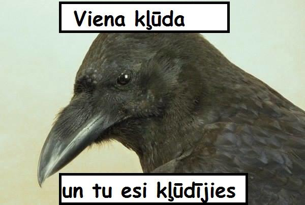

# Inese Jurkijāne - par mani
### Izglītība:
Bakalaura grāds krievu filoloģijā (Latvijas Universitāte)

### Darba pieredze:
Lielākoties saistīta ar saturu: gan internetveikaliem, gan citām vietnēm (attēlu apstrāde, aprakstu veidošana, labošana, tulkošana un pievienošana vietnēm, klientu apkalpošana, kā arī citi saistīti pienākumi). No pagājušā gada maija strādāju testētāja amatā.

### Prasmes:
Labas latviešu, krievu un angļu valodas zināšanas mutiski un rakstiski, iemaņas darbā ar Adobe Photoshop, labas saskarsmes prasmes, iemaņas klientu apkalpošanā, sociālo tīklu kontu administrēšanā, satura veidošanā, dažādu mārketinga kampaņu izveidē un uzturēšanā, mājaslapu satura labošanā, izveidošanā un uzturēšanā u.c.

### Hobiji un intereses:
Makšķerēšana, kulinārija, mūzika, loka šaušana, daba, dzīvnieki, grāmatas

### Mīļākā grāmata:
Džeralda Darela *"Zaļā paradīze"*

### Mīļākā filma:
*Deadpool*

### Mīļākais seriāls:
*Fleabag*

### Top ēdieni, ko māku pagatavot:
Picas un visdažādākās kūkas, it sevišķi - siera kūkas. Bet kopumā padodas (un garšo :D) gandrīz viss.

### Vieta, ko gribētu apmeklēt:
Korfu sala Grieķijā

### Top moto/meme:

### Daži fun facts:
* Ģimenē esam 4 māsas; 3 no visām esam dzimušas vienā gadā, bet neesam trīnes
* Man ir traktora vadīšanas tiesības
* Atsaucoties uz Spotify statistiku, pagājušogad klausījos vairāk mūziku kā 99% Latvijas iedzīvotāju :D
* Samērā skarba un sarkastiska humora izjūta
* Introverts
* Spiritual animal: Grumpy cat
* Mīļākais dzēriens: viskijs
* Pēdējā dziesma, ko pievienoju "Like" listei: [Hahlweg - Make This Go On Forever](https://youtu.be/nZayW0KT-AQ)
* Domāju latgaliski